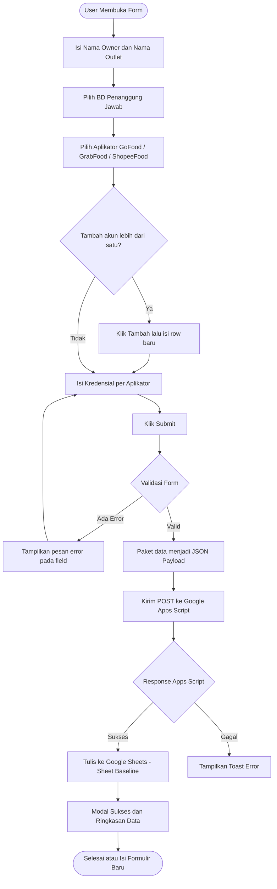
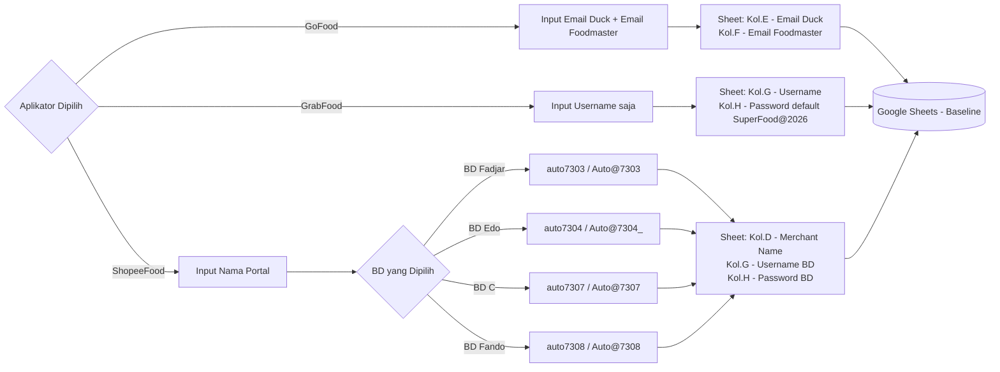
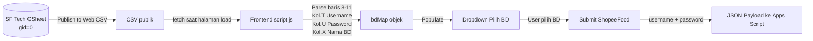

# Portal Kredensial SuperFood (FoodMaster)

Website formulir integrasi modern untuk melengkapi data owner, nama outlet, BD penanggung jawab, serta kredensial akses aplikator merchant secara adaptif (GoFood, GrabFood, dan ShopeeFood). Dibangun dengan HTML, CSS, dan JavaScript murni, serta diintegrasikan dengan **Google Sheets** melalui **Google Apps Script**. Dideploy ke **Vercel** dengan sinkronisasi otomatis via **GitHub**.

---

## 🔄 Alur Sistem

### Alur Pengisian & Pengiriman Data



### Logika Kredensial per Aplikator



### Alur Pengambilan Data BD dari Google Sheet



---

## ✨ Fitur Utama

1. **Adaptive Input Fields**: Tampilan kolom kredensial berubah secara dinamis berdasarkan aplikator terpilih:
   * **GoFood**: Input **Email Duck** + **Email Foodmaster** (dengan suffix `@byfoodmaster.com` otomatis).
   * **GrabFood**: Hanya input **Username** — Password `SuperFood@2026` dikirim otomatis ke sheet (tidak ditampilkan ke user).
   * **ShopeeFood**: Input **Nama Portal** — Username & Password BD diambil otomatis dari Google Sheet SF Tech.
2. **Dropdown BD Dinamis**: Pilihan BD (Business Development) diambil secara realtime dari Google Sheet "SF Tech" setiap kali halaman dibuka.
3. **Multi-Row Input**: Setiap aplikator mendukung penambahan akun lebih dari satu dengan tombol "Tambah".
4. **Desain Glassmorphism Premium**: Background blur, gradien bercahaya, dan mesh background berpendar.
5. **Mode Gelap/Terang**: Toggle tema yang tersimpan di `localStorage` dan mengikuti preferensi sistem.
6. **Validasi Real-time**: Ikon centang/silang dan pesan error per field secara langsung.
7. **Sinkronisasi Google Sheets**: Data dikirim sekuensial (satu per satu) ke Google Sheets melalui Apps Script Web App untuk menghindari konflik.

---

## 📁 Struktur Berkas

```text
superfood_webform/
├── index.html       # Halaman utama - struktur form HTML5 semantik
├── style.css        # Sistem desain: CSS Variables, glassmorphism, animasi
├── script.js        # Logika form, fetch BD CSV, submit ke Apps Script
├── AppsScript.gs    # Kode Google Apps Script (deploy manual ke GAS editor)
├── vercel.json      # Konfigurasi routing Vercel
├── Logo/            # Aset logo aplikator (GoFood, GrabFood, ShopeeFood, brand)
└── README.md        # Dokumentasi ini
```

---

## ⚙️ Konfigurasi

### Variabel Penting di `script.js`

| Variabel | Keterangan |
|---|---|
| `WEB_APP_URL` | URL deployment Google Apps Script Web App |
| `BD_CONFIG_CSV_URL` | URL CSV publik Google Sheet "SF Tech" (gid=0) |
| `ENABLE_SHEET_SUBMISSION` | `true` untuk kirim ke Sheets, `false` untuk simulasi lokal |
| `bdMap` | Fallback hardcode BD jika fetch CSV gagal |

### Mapping Kolom Google Sheet (Sheet: `Baseline`)

| Kolom | Data |
|---|---|
| A | Nama Owner |
| B | Nama Outlet |
| C | Nama Aplikator (GoFood / GrabFood / ShopeeFood) |
| D | Merchant Name *(khusus ShopeeFood)* |
| E | Email Duck *(khusus GoFood)* |
| F | Email Foodmaster *(khusus GoFood)* |
| G | Username *(GrabFood: dari input / ShopeeFood: dari BD map)* |
| H | Password *(GrabFood: `SuperFood@2026` / ShopeeFood: dari BD map)* |

### Sumber Data BD (Google Sheet "SF Tech", gid=0)

| Kolom Sheet | Data | Index Array (0-based) |
|---|---|---|
| T | Username BD | 19 |
| U | Password BD | 20 |
| X | Nama BD | 23 |

Data dibaca hanya dari **baris 8 sampai 11**.

---

## 🚀 Cara Deploy

### Deploy ke Vercel (Otomatis via GitHub)

1. Push perubahan ke branch `main` di GitHub:
   ```bash
   git add .
   git commit -m "Update"
   git push origin main
   ```
2. Vercel akan otomatis mendeteksi push dan men-deploy ulang.

### Setup Google Apps Script

1. Buka [script.google.com](https://script.google.com/)
2. Buat project baru dan salin seluruh isi `AppsScript.gs`
3. Klik **Deploy** → **New Deployment** → pilih tipe **Web App**
4. Atur:
   - **Execute as**: Me
   - **Who has access**: Anyone
5. Salin URL deployment dan tempel ke variabel `WEB_APP_URL` di `script.js`
6. Lakukan re-deploy setiap kali ada perubahan kode di `AppsScript.gs`

### Setup Google Sheet "SF Tech" (Sumber BD)

1. Buka Google Sheet "SF Tech"
2. Klik **File** → **Share** → **Publish to the web**
3. Pilih **Sheet pertama** (gid=0) → format **CSV**
4. Salin URL yang dihasilkan ke variabel `BD_CONFIG_CSV_URL` di `script.js`

---

## 🛠️ Troubleshooting

| Masalah | Kemungkinan Penyebab | Solusi |
|---|---|---|
| Dropdown BD tidak update | Sheet belum di-publish / fetch gagal | Pastikan sheet sudah di-publish to web sebagai CSV, periksa `BD_CONFIG_CSV_URL` |
| Data tidak masuk ke sheet | Apps Script belum di-deploy ulang | Buat deployment baru (New Version) di GAS editor |
| Sheet target tidak ditemukan | Nama sheet salah | Pastikan nama sheet tujuan adalah `Baseline` |
| BD tidak sesuai di Shopee | Indeks kolom/baris salah | Verifikasi data di baris 8-11, kolom T, U, X di SF Tech sheet |
